# **Traffic Sign Recognition** 

**Note:** For more information, see the code in the [IPython notebook](https://github.com/Eldurkar/CarND_Traffic_Sign_Classifier_Project_P3/blob/master/Traffic_Sign_Classifier.ipynb) in this repo. Also available as [html](https://github.com/Eldurkar/CarND_Traffic_Sign_Classifier_Project_P3/blob/master/Traffic_Sign_Classifier.html).

---

**A Traffic Sign Recognition Classifier**

Create a convolutional neural network that trains on a set of traffic sign images and their labels to be able to predict the correct classification for a “new” traffic sign image.

* Load the data set (see below for links to the project data set)
* Explore, summarize and visualize the data set
* Design, train and test a model architecture
* Use the model to make predictions on new images
* Analyze the softmax probabilities of the new images
* Summarize the results with a written report

### Data Set Summary & Exploration

#### 1. The numpy library was used to calculate summary statistics of the traffic signs data set:
* Number of training examples = 34799
* Number of testing examples = 12630
* Shape of a traffic sign image = (32, 32, 3)
* The number of unique classes/labels in the data set = 43

#### 2. Exploratory visualization of the dataset

Here is an exploratory visualization of the data set. A sample of about 20 images from the training examples was displayed to visualize the traffic signs.  The images were also visualized in grayscale. 

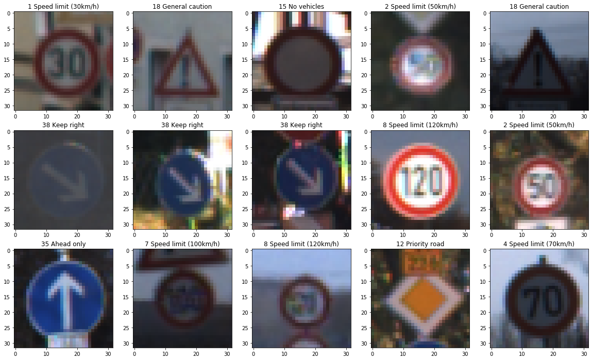 

Using Seaborn a countplot was plotted to display the classes and the count of samples for each class of the training data.  The histogram shows that some of the traffic signals are not adequately represented, having lesser than 200 test images vis-a-vis the maximum at approximately 2000 images. These traffic signals were augmented in the preprocessing stage.

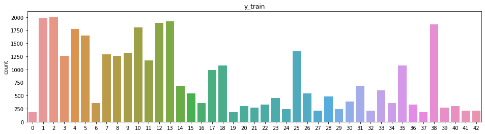

### Design and Test a Model Architecture

#### 1. Preprocessing image data

Training a convolutional neural network on raw images will probably lead to bad classification performances (Pal & Sudeep, 2016). The preprocessing is also important to speed up training (for instance, centering and scaling techniques, see Lecun et al., 2012; see 4.3).

**Data augmentation**
Preprocessing techniques used to sythesize image data for augmentation include:
1. Change contrast
2. Rotate images
3. Add noise / blur

Here is an example of a traffic sign image before and after using a YUV enhancement technique to change the contrast of the image.

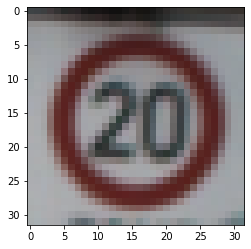	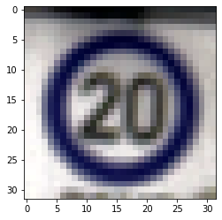

**Data imbalance**
A popular method to solve imbalance problem is data augmentation which increases the apparent number of samples in minority classes to balance between majority classes and minority classes by applying the geometric transformations or adding noise to training samples.

The difference between the original data set and the augmented data set is the following - the under represented classes are now adequate in number, from the previous ratio of 1:9 to 2:3.

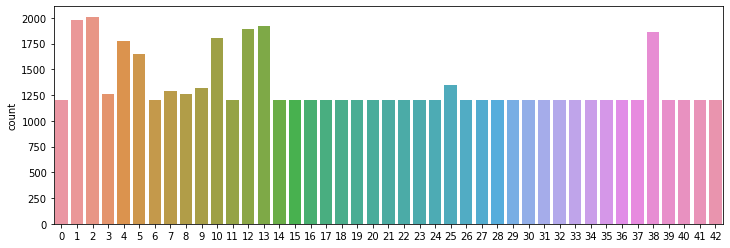

**Normalization**
The augmented data was then normalized using mean and standard deviation. The scale of the data has an effect on the magnitude of the gradient for the weights. If the gradient is big, the learning rate will need to be reduced. Normalizing the image to smaller pixel values is a cheap price to pay while making it easier to tune an optimal learning rate for input images.

 ... 

#### 2. Model architecture

The final model consisted of the following layers:

| Layer         		|     Description	        					| 
|:---------------------:|:---------------------------------------------:| 
| Input         		| 32x32x3 RGB image   							| 
| Convolution	     	| 1x1 stride, valid padding, outputs 28x28x32 	|
| RELU					|												|
| Max pooling	      	| 2x2 stride, outputs 14x14x32 					|
| Convolution		    | 1x1 stride, valid padding, outputs 10x10x64	|
| RELU					| 												|
| Max pooling			| 2x2 stride, outputs 5x5x64					|
| Fully connected		| Input = 1600. Output = 120.					|
| RELU					|												|
| Dropout				|												|
| Fully connected		| 2x2 stride, outputs 14x14x32 					|
| RELU					|												|
| Dropout				|												|
| Fully connected 		| Output layer. Input = 84. Output = 43.		|

#### 3. Here are the parameters that were used while training the model:
`# Training parameters
learning_rate = 0.001
epochs = 10
batch_size = 256`

`# Network parameters
dropout = 0.75`

The [Adam optimizer](https://www.tensorflow.org/api_docs/python/tf/keras/optimizers/Adam) was used to minimize the loss(cross entropy).

#### 4. The following are the results of the final model:

* training set accuracy of 0.999
* validation set accuracy of 0.966 
* test set accuracy of 0.955

The architecture chosen was a modified version of the LeNet model. After performing an activation on the two fully connected layers a dropout was performed to reduce overfitting and improve generalization error. If the validation accuracy is considerably lower than the training accuracy, this indicates overfit.

The basic solution approach was to monitor the validation accuracy while training. If the validation accuracy is decreasing or stays the same, the hyperparameters were tuned, the size of the convnet was reduced or dropout was reduced.

Increasing the batch size from 128 to 256 improved the accuracy.

### Test a Model on New Images

#### 1. Here are five German traffic signs that were found on the web:

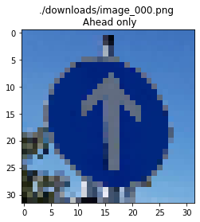 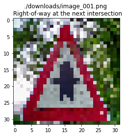 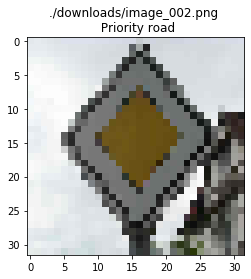 
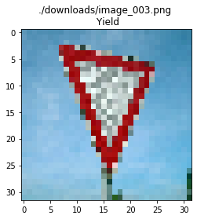 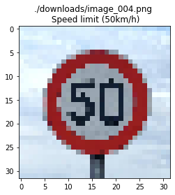

The second image (Right of way at next intersection) might be difficult to classify because the black pattern within the red triangle is not clear.
The fourth image (Yield) looks like there might be something more within the triangle.

#### 2. Here are the results of the prediction:

| Image			        	|     Prediction	        		| 
|:-------------------------:|:---------------------------------:| 
| Ahead only      			| Ahead only   						| 
| Right of way at next int. | Right of way at next int.			|
| Priority road				| Priority road						|
| Yield						| Yield								|
| 50 km/h	      			| 50 km/h						 	|

The model was able to correctly guess all of the 5 traffic signs.

#### 3. The top 5 softmax probabilities for each image along with the probabilities were visualized using a bar plot as shown below.

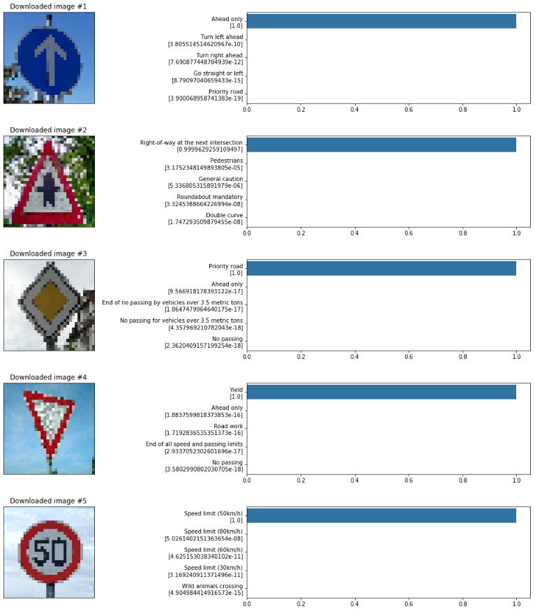

### References
The code in this project was adapted from the following sources:
1. Lessons and videos that are part of the advanced lane finding project. 
2. [Aymeric Damien](https://github.com/aymericdamien) and [Keisuke Shimokawa](https://github.com/KeisukeShimokawa)